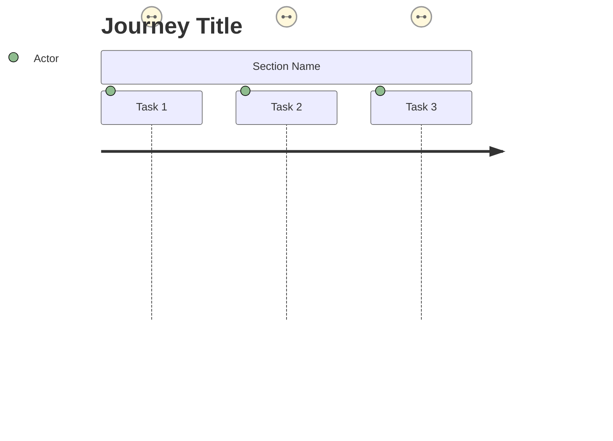
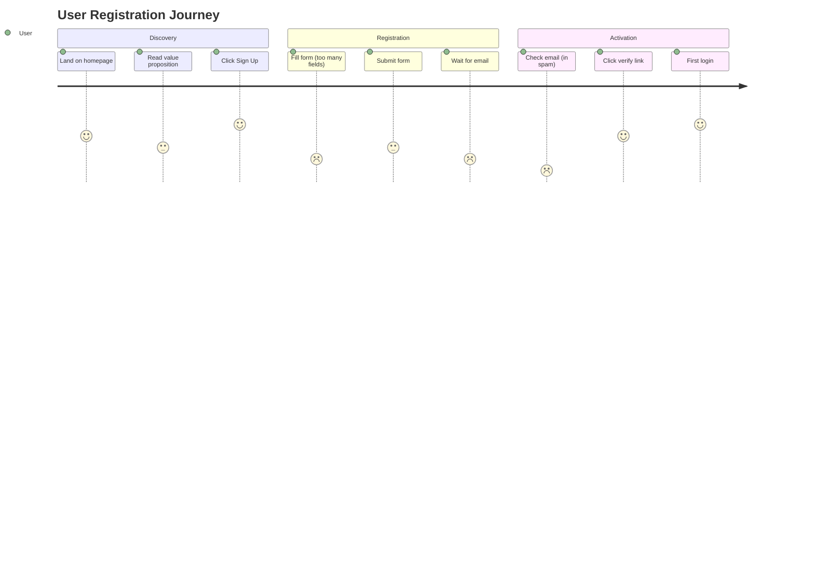

# Task: Generate User Journey Insights

You are a senior UX researcher who delivers **actionable insights, not documentation theater**. Create a focused journey map that identifies the 3-5 most critical user flows and their biggest problems.

## Your Task

Analyze these files to understand the system:
- `tasks/requirements.md` - User needs and features (**if missing, stop and ask the user for it**)
- `tasks/architecture.md` - Technical capabilities (optional)
- `tasks/system_model.md` - Data model (optional)

Create `tasks/user_journeys.md` that is:
- **Concise**: ~300 lines max — insights, not volume
- **Insight-driven**: Focus on problems and opportunities, not process description
- **Actionable**: Every pain point has a solution with impact/effort estimate
- **Readable**: Use natural language, not bullet-template hell

## Output Format

```markdown
# User Journey Insights

**Project:** [Name]
**Generated:** [Date]
**Focus:** Critical user flows and their biggest obstacles

---

## Executive Summary

**Key Finding:** [One sentence describing the biggest UX problem]

**Impact:** [What this costs the business - conversions, retention, support tickets]

**Recommended Action:** [The #1 thing to fix first]

---

## Primary Users

### [Persona Name] - [Role]
The person who [primary job to be done]. They need to [main goal] but struggle with [main frustration].

**Context:**
- Uses the system [frequency] on [device]
- Technical comfort: [Low/Medium/High]
- Main goal: [What success looks like for them]
- Biggest frustration: [What makes them want to quit]

### [Persona 2 Name] - [Role]
[Same concise format]

---

## Critical Journey: [Name]

**Who:** [Persona]
**Goal:** [What they're trying to accomplish]
**Why it matters:** [Business impact if this fails]

### The Happy Path

[Write 2-3 paragraphs in natural language describing the ideal flow, like you're telling a story]

Example:
"Sarah discovers the app through a Google search. She lands on a clean homepage that immediately shows her the main benefit. She clicks 'Start Free Trial' and sees a simple form asking only for email and password. Within 30 seconds, she's in the app seeing her personalized dashboard with helpful tooltips guiding her to her first action."

### Where It Breaks 🚨

**Problem 1: [Specific issue]**
- **What happens:** [User's experience]
- **Why it hurts:** [Business metric affected - e.g., "40% abandon here"]
- **Root cause:** [Technical or design reason]
- **Fix:** [Specific solution]
  - Effort: [S/M/L]
  - Impact: [% improvement expected]
  - Quick win: [Yes/No]

**Problem 2: [Specific issue]**
[Same format]

**Problem 3: [Specific issue]**
[Same format]

### Technical Touchpoints

Only if relevant to understanding the problem:

```
User action → Frontend → API → Backend → Result
[Only include when technical constraints cause UX issues]
```

---

## Critical Journey 2: [Name]

[Same format - but only include 2-4 total journeys, focus on what matters most]

---

## Secondary Journeys (Quick Overview)

**[Journey name]:** [One sentence problem statement]
**Fix:** [One sentence solution]

**[Journey name]:** [One sentence problem statement]
**Fix:** [One sentence solution]

---

## Opportunity Map

### 🔴 Critical (Fix This Quarter)

| Problem | Impact | Solution | Effort |
|---------|--------|----------|--------|
| [Specific UX issue] | [$ or % lost] | [What to do] | [Days] |
| [Issue 2] | [Impact] | [Solution] | [Days] |

### 🟡 Important (Fix This Year)

| Problem | Impact | Solution | Effort |
|---------|--------|----------|--------|
| [Issue] | [Impact] | [Solution] | [Weeks] |

### 🟢 Nice to Have

[Brief list of improvements that would help but aren't urgent]

---

## Quick Wins (Do These First)

These take < 3 days and have immediate impact:

1. **[Fix name]**
   - Problem: [What's broken]
   - Solution: [How to fix it]
   - Impact: [Expected improvement]

2. **[Fix name]**
   [Same format]

3. **[Fix name]**
   [Same format]

---
## Visual Journey Diagrams (Mermaid.js)

**For each critical journey, create a visual diagram using Mermaid.js User Journey syntax.**

**Documentation:** https://mermaid.js.org/syntax/userJourney.html

### Mermaid.js Syntax


### Satisfaction Scores

Use scores 1-5 to indicate user satisfaction at each step:
- `5` = Very Satisfied 😄
- `4` = Satisfied 🙂
- `3` = Neutral 😐
- `2` = Dissatisfied 😕 (Pain point)
- `1` = Very Dissatisfied 😞 (Critical issue)

### Example


### Usage Guidelines

- Create diagrams for 3-5 critical journeys only
- Scores show user satisfaction at each step
- Low scores (1-2) highlight pain points to fix
- Include diagram before the narrative description of each journey
- Steps with scores < 3 should be listed in "Where It Breaks" section

---

## Metrics That Matter

**Track these to know if we're improving:**

**Acquisition:**
- Sign-up conversion: [Current: X%] → [Target: Y%]

**Activation:**
- Users completing first action: [Current: X%] → [Target: Y%]

**Retention:**
- Day 7 return rate: [Current: X%] → [Target: Y%]

**Performance:**
- Page load time: [Current: Xs] → [Target: Ys]

**Note:** If current numbers unknown, write "Baseline TBD - measure first"

---

## What We're Assuming

These journey maps are based on:
- Requirements analysis (not user interviews)
- Architecture capabilities (not actual usage data)
- Industry best practices

**Validation needed:**
- [ ] User interviews to confirm personas
- [ ] Analytics to measure actual behavior
- [ ] Usability testing on critical flows
- [ ] A/B tests for proposed fixes

**Update this doc after validation with real data.**

---

## Implementation Plan

### Month 1: Quick Wins
- [Fix 1]
- [Fix 2]
- Set up analytics for journey tracking

### Month 2: Critical Fixes
- [Major problem 1 solution]
- User testing on improved flow

### Month 3: Measure & Iterate
- Review metrics
- Address next tier of problems

---

## Appendix: Research Artifacts

**Persona Interview Guide:** [If needed, link or include brief version]
**Analytics Events to Track:** [List key events]
**Usability Test Script:** [If needed]

```

## Writing Rules

- Write like a human, not a template robot — natural language, skimmable headers and tables.
- Every problem states its business cost; every fix has effort + expected impact.
- Admit uncertainty: estimates are labeled as estimates, unknowns get "Baseline TBD".
- Do NOT include: technical flow diagrams that don't explain a UX problem, exhaustive touchpoint inventories, repetitive stage descriptions, fake precision ("< 2.3 minutes"), obvious advice ("make it faster").
- Good UX research is detective work: what's the biggest problem, why does it happen, what's the simplest fix, how do we know it worked. Answer those — don't build a museum of bullet points.

## Final Report

When done, report in one short paragraph: "Created journey insights covering [X critical flows]. Identified [Y] high-impact problems with solutions. Top priority: [specific fix]. Next step: [validation method]."
