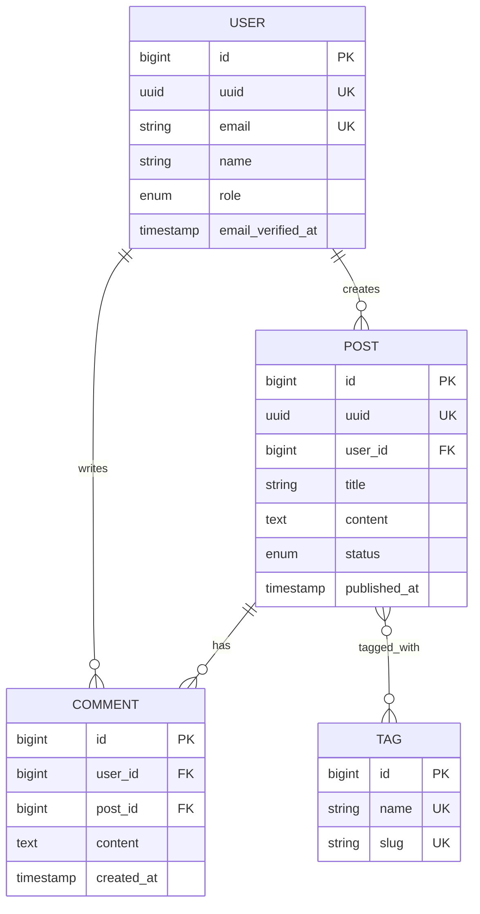

# Database Design — Document Template

# Database Design

**Generated**: [Date]
**Database**: MySQL 8.0 / PostgreSQL 17
**Laravel**: 13.x
**ORM**: Eloquent

---

## Overview

**Database Choice**: [MySQL/PostgreSQL] - [Why: e.g., JSON support, full-text search]

**Naming Conventions**:
- Tables: `plural_snake_case` (users, order_items)
- Columns: `snake_case` (created_at, user_id)
- Foreign keys: `{singular}_id` (user_id, product_id)
- Pivot tables: alphabetical (post_tag, not tag_post)
- Indexes: `{table}_{columns}_{type}` (users_email_unique)

---

## Entity Relationship Diagram



---

## Tables & Migrations

### Core Tables

#### users
**Purpose**: Authentication and user profiles

```php
<?php

use Illuminate\Database\Migrations\Migration;
use Illuminate\Database\Schema\Blueprint;
use Illuminate\Support\Facades\Schema;

return new class extends Migration
{
    public function up(): void
    {
        Schema::create('users', function (Blueprint $table) {
            $table->id();
            $table->uuid()->unique();
            $table->string('name');
            $table->string('email')->unique();
            $table->timestamp('email_verified_at')->nullable();
            $table->string('password');
            $table->string('avatar_url')->nullable();
            $table->enum('role', ['user', 'admin', 'moderator'])->default('user');
            $table->enum('status', ['active', 'suspended', 'banned'])->default('active');
            $table->timestamp('last_login_at')->nullable();
            $table->rememberToken();
            $table->timestamps();
            $table->softDeletes();

            // Indexes
            $table->index(['role', 'status']);
            $table->index('created_at');
        });
    }

    public function down(): void
    {
        Schema::dropIfExists('users');
    }
};
```

**Eloquent Model**:
```php
<?php

namespace App\Models;

use Illuminate\Database\Eloquent\Concerns\HasUuids;
use Illuminate\Database\Eloquent\Factories\HasFactory;
use Illuminate\Database\Eloquent\SoftDeletes;
use Illuminate\Foundation\Auth\User as Authenticatable;
use Illuminate\Notifications\Notifiable;

class User extends Authenticatable
{
    use HasFactory, HasUuids, Notifiable, SoftDeletes;

    protected $fillable = [
        'name',
        'email',
        'password',
        'avatar_url',
        'role',
        'status',
    ];

    protected $hidden = [
        'password',
        'remember_token',
    ];

    protected function casts(): array
    {
        return [
            'email_verified_at' => 'datetime',
            'last_login_at' => 'datetime',
            'password' => 'hashed',
        ];
    }

    // Relationships
    public function posts()
    {
        return $this->hasMany(Post::class);
    }

    public function comments()
    {
        return $this->hasMany(Comment::class);
    }

    // Scopes
    public function scopeActive($query)
    {
        return $query->where('status', 'active');
    }

    public function scopeAdmins($query)
    {
        return $query->where('role', 'admin');
    }

    // Accessors
    public function isAdmin(): bool
    {
        return $this->role === 'admin';
    }
}
```

---

#### posts
**Purpose**: User-generated content

```php
<?php

use Illuminate\Database\Migrations\Migration;
use Illuminate\Database\Schema\Blueprint;
use Illuminate\Support\Facades\Schema;

return new class extends Migration
{
    public function up(): void
    {
        Schema::create('posts', function (Blueprint $table) {
            $table->id();
            $table->uuid()->unique();
            $table->foreignId('user_id')->constrained()->cascadeOnDelete();
            $table->string('title');
            $table->string('slug')->unique();
            $table->text('content');
            $table->text('excerpt')->nullable();
            $table->string('featured_image')->nullable();
            $table->enum('status', ['draft', 'published', 'archived'])->default('draft');
            $table->timestamp('published_at')->nullable();
            $table->unsignedInteger('views_count')->default(0);
            $table->timestamps();
            $table->softDeletes();

            // Indexes
            $table->index(['user_id', 'status']);
            $table->index(['status', 'published_at']);
            $table->index('created_at');

            // Full-text search (MySQL 8.0+)
            $table->fullText(['title', 'content']);
        });
    }

    public function down(): void
    {
        Schema::dropIfExists('posts');
    }
};
```

**Eloquent Model**:
```php
<?php

namespace App\Models;

use Illuminate\Database\Eloquent\Concerns\HasUuids;
use Illuminate\Database\Eloquent\Factories\HasFactory;
use Illuminate\Database\Eloquent\Model;
use Illuminate\Database\Eloquent\SoftDeletes;
use Illuminate\Support\Str;

class Post extends Model
{
    use HasFactory, HasUuids, SoftDeletes;

    protected $fillable = [
        'user_id',
        'title',
        'slug',
        'content',
        'excerpt',
        'featured_image',
        'status',
        'published_at',
    ];

    protected function casts(): array
    {
        return [
            'published_at' => 'datetime',
        ];
    }

    // Auto-generate slug
    protected static function booted(): void
    {
        static::creating(function (Post $post) {
            if (empty($post->slug)) {
                $post->slug = Str::slug($post->title);
            }
        });
    }

    // Relationships
    public function user()
    {
        return $this->belongsTo(User::class);
    }

    public function comments()
    {
        return $this->hasMany(Comment::class);
    }

    public function tags()
    {
        return $this->belongsToMany(Tag::class)
            ->withTimestamps();
    }

    // Scopes
    public function scopePublished($query)
    {
        return $query->where('status', 'published')
            ->whereNotNull('published_at')
            ->where('published_at', '<=', now());
    }

    public function scopePopular($query)
    {
        return $query->orderBy('views_count', 'desc');
    }

    // Accessors
    public function isPublished(): bool
    {
        return $this->status === 'published'
            && $this->published_at?->isPast();
    }

    // Route binding
    public function getRouteKeyName(): string
    {
        return 'slug';
    }
}
```

---

#### comments
**Purpose**: User comments on posts

```php
<?php

use Illuminate\Database\Migrations\Migration;
use Illuminate\Database\Schema\Blueprint;
use Illuminate\Support\Facades\Schema;

return new class extends Migration
{
    public function up(): void
    {
        Schema::create('comments', function (Blueprint $table) {
            $table->id();
            $table->foreignId('user_id')->constrained()->cascadeOnDelete();
            $table->foreignId('post_id')->constrained()->cascadeOnDelete();
            $table->foreignId('parent_id')->nullable()->constrained('comments')->cascadeOnDelete();
            $table->text('content');
            $table->enum('status', ['pending', 'approved', 'spam'])->default('pending');
            $table->timestamps();
            $table->softDeletes();

            // Indexes
            $table->index(['post_id', 'status']);
            $table->index('parent_id');
            $table->index('created_at');
        });
    }

    public function down(): void
    {
        Schema::dropIfExists('comments');
    }
};
```

**Eloquent Model**:
```php
<?php

namespace App\Models;

use Illuminate\Database\Eloquent\Factories\HasFactory;
use Illuminate\Database\Eloquent\Model;
use Illuminate\Database\Eloquent\SoftDeletes;

class Comment extends Model
{
    use HasFactory, SoftDeletes;

    protected $fillable = [
        'user_id',
        'post_id',
        'parent_id',
        'content',
        'status',
    ];

    // Relationships
    public function user()
    {
        return $this->belongsTo(User::class);
    }

    public function post()
    {
        return $this->belongsTo(Post::class);
    }

    // Nested comments
    public function parent()
    {
        return $this->belongsTo(Comment::class, 'parent_id');
    }

    public function replies()
    {
        return $this->hasMany(Comment::class, 'parent_id');
    }

    // Scopes
    public function scopeApproved($query)
    {
        return $query->where('status', 'approved');
    }

    public function scopeTopLevel($query)
    {
        return $query->whereNull('parent_id');
    }
}
```

---

#### tags
**Purpose**: Post categorization

```php
<?php

use Illuminate\Database\Migrations\Migration;
use Illuminate\Database\Schema\Blueprint;
use Illuminate\Support\Facades\Schema;

return new class extends Migration
{
    public function up(): void
    {
        Schema::create('tags', function (Blueprint $table) {
            $table->id();
            $table->string('name')->unique();
            $table->string('slug')->unique();
            $table->text('description')->nullable();
            $table->unsignedInteger('posts_count')->default(0);
            $table->timestamps();

            $table->index('slug');
        });
    }

    public function down(): void
    {
        Schema::dropIfExists('tags');
    }
};
```

**Eloquent Model**:
```php
<?php

namespace App\Models;

use Illuminate\Database\Eloquent\Factories\HasFactory;
use Illuminate\Database\Eloquent\Model;
use Illuminate\Support\Str;

class Tag extends Model
{
    use HasFactory;

    protected $fillable = [
        'name',
        'slug',
        'description',
    ];

    protected static function booted(): void
    {
        static::creating(function (Tag $tag) {
            if (empty($tag->slug)) {
                $tag->slug = Str::slug($tag->name);
            }
        });
    }

    public function posts()
    {
        return $this->belongsToMany(Post::class)
            ->withTimestamps();
    }

    public function getRouteKeyName(): string
    {
        return 'slug';
    }
}
```

---

### Pivot Tables

#### post_tag
**Purpose**: Many-to-many relationship between posts and tags

```php
<?php

use Illuminate\Database\Migrations\Migration;
use Illuminate\Database\Schema\Blueprint;
use Illuminate\Support\Facades\Schema;

return new class extends Migration
{
    public function up(): void
    {
        Schema::create('post_tag', function (Blueprint $table) {
            $table->foreignId('post_id')->constrained()->cascadeOnDelete();
            $table->foreignId('tag_id')->constrained()->cascadeOnDelete();
            $table->timestamps();

            $table->primary(['post_id', 'tag_id']);
        });
    }

    public function down(): void
    {
        Schema::dropIfExists('post_tag');
    }
};
```

---

## Advanced Patterns

### Polymorphic Relationships (if needed)

**Example: Attachments for multiple models**

```php
// Migration
Schema::create('attachments', function (Blueprint $table) {
    $table->id();
    $table->morphs('attachable'); // Creates attachable_id, attachable_type
    $table->string('filename');
    $table->string('path');
    $table->string('mime_type');
    $table->unsignedBigInteger('size');
    $table->timestamps();

    $table->index(['attachable_type', 'attachable_id']);
});

// Model
class Attachment extends Model
{
    public function attachable()
    {
        return $this->morphTo();
    }
}

// Usage in Post model
public function attachments()
{
    return $this->morphMany(Attachment::class, 'attachable');
}
```

### JSON Columns (if needed)

```php
// Migration
Schema::create('settings', function (Blueprint $table) {
    $table->id();
    $table->foreignId('user_id')->constrained()->cascadeOnDelete();
    $table->json('preferences');
    $table->json('notification_settings');
    $table->timestamps();
});

// Model
protected function casts(): array
{
    return [
        'preferences' => 'array',
        'notification_settings' => 'array',
    ];
}

// Usage
$user->settings->preferences = [
    'theme' => 'dark',
    'language' => 'en',
];
```

### Composite Indexes

```php
// For complex queries
$table->index(['user_id', 'status', 'created_at'], 'user_status_created_idx');

// Unique composite
$table->unique(['user_id', 'post_id'], 'user_post_unique');
```

---

## Migration Execution Order

Run migrations in dependency order:

1. **Independent tables** (no foreign keys):
   ```
   2024_01_01_000001_create_users_table.php
   2024_01_01_000002_create_tags_table.php
   ```

2. **Dependent tables**:
   ```
   2024_01_01_000003_create_posts_table.php      (depends on users)
   2024_01_01_000004_create_comments_table.php   (depends on users, posts)
   ```

3. **Pivot tables** (last):
   ```
   2024_01_01_000005_create_post_tag_table.php   (depends on posts, tags)
   ```

**Commands**:
```bash
# Run all migrations
php artisan migrate

# Rollback last batch
php artisan migrate:rollback

# Fresh start (DESTROYS DATA!)
php artisan migrate:fresh --seed

# Check status
php artisan migrate:status
```

---

## Indexes Summary

| Table | Index | Type | Purpose |
|-------|-------|------|---------|
| users | email | unique | Login lookup |
| users | uuid | unique | API public ID |
| users | (role, status) | composite | Admin filtering |
| posts | slug | unique | URL routing |
| posts | (user_id, status) | composite | User's posts |
| posts | (title, content) | fulltext | Search |
| comments | (post_id, status) | composite | Post comments |
| post_tag | (post_id, tag_id) | primary | Pivot lookup |

---

## Performance Optimization

### Eager Loading
```php
// Prevent N+1 queries
Post::with(['user', 'tags', 'comments.user'])->get();

// Load counts
Post::withCount(['comments', 'tags'])->get();

// Conditional loading
Post::with(['comments' => function ($query) {
    $query->approved()->limit(5);
}])->get();
```

### Query Caching
```php
use Illuminate\Support\Facades\Cache;

// Cache for 1 hour
$posts = Cache::remember('posts.published', 3600, function () {
    return Post::published()->with('user')->get();
});

// Cache tags (Redis only)
Cache::tags(['posts', 'featured'])->remember('posts.featured', 3600, fn() => ...);

// Clear cache
Cache::forget('posts.published');
Cache::tags(['posts'])->flush();
```

### Database Transactions
```php
use Illuminate\Support\Facades\DB;

DB::transaction(function () {
    $post = Post::create([...]);
    $post->tags()->attach([1, 2, 3]);
    $post->user->increment('posts_count');
});
```

---

## Seeding

### Factory Definitions

**UserFactory**:
```php
<?php

namespace Database\Factories;

use Illuminate\Database\Eloquent\Factories\Factory;
use Illuminate\Support\Facades\Hash;
use Illuminate\Support\Str;

class UserFactory extends Factory
{
    protected static ?string $password = null;

    public function definition(): array
    {
        return [
            'name' => fake()->name(),
            'email' => fake()->unique()->safeEmail(),
            'email_verified_at' => now(),
            'password' => static::$password ??= Hash::make('password'),
            'role' => 'user',
            'status' => 'active',
            'remember_token' => Str::random(10),
        ];
    }

    public function admin(): static
    {
        return $this->state(fn (array $attributes) => [
            'role' => 'admin',
        ]);
    }

    public function unverified(): static
    {
        return $this->state(fn (array $attributes) => [
            'email_verified_at' => null,
        ]);
    }
}
```

**DatabaseSeeder**:
```php
<?php

namespace Database\Seeders;

use App\Models\Post;
use App\Models\Tag;
use App\Models\User;
use Illuminate\Database\Seeder;

class DatabaseSeeder extends Seeder
{
    public function run(): void
    {
        // Create admin
        User::factory()->admin()->create([
            'email' => 'admin@example.com',
        ]);

        // Create users
        $users = User::factory(50)->create();

        // Create tags
        $tags = Tag::factory(20)->create();

        // Create posts with relationships
        $users->each(function ($user) use ($tags) {
            Post::factory(5)
                ->for($user)
                ->hasComments(3)
                ->create()
                ->each(fn ($post) => $post->tags()->attach(
                    $tags->random(rand(1, 5))
                ));
        });
    }
}
```

---

## Security

### Mass Assignment Protection
```php
// Always define fillable or guarded
protected $fillable = ['name', 'email'];

// Or use guarded (opposite)
protected $guarded = ['id', 'is_admin'];
```

### Query Safety
```php
// ✅ Safe - uses prepared statements
User::where('email', $request->email)->first();

// ❌ Dangerous - SQL injection risk
User::whereRaw("email = '{$request->email}'")->first();

// ✅ Safe raw with bindings
User::whereRaw('email = ?', [$request->email])->first();
```

### Encrypted Columns
```php
// Migration
$table->text('ssn');

// Model
protected function casts(): array
{
    return [
        'ssn' => 'encrypted',
    ];
}
```

---

## Testing

```php
<?php

use App\Models\Post;
use App\Models\User;
use Illuminate\Foundation\Testing\RefreshDatabase;

uses(RefreshDatabase::class);

test('user can create post', function () {
    $user = User::factory()->create();

    $post = Post::factory()->for($user)->create();

    expect($post->user_id)->toBe($user->id)
        ->and($post->user)->toBeInstanceOf(User::class);
});

test('post can have tags', function () {
    $post = Post::factory()
        ->hasTags(3)
        ->create();

    expect($post->tags)->toHaveCount(3);
});
```

---

## Notes

- All IDs use `bigInteger` unsigned
- UUIDs for public API exposure
- Soft deletes on user-facing data
- Timestamps on all tables
- Foreign keys use cascade delete where appropriate
- Indexes optimized for common queries
- Full-text search on content-heavy columns

Generate complete database design with working Laravel migrations and Eloquent models.
